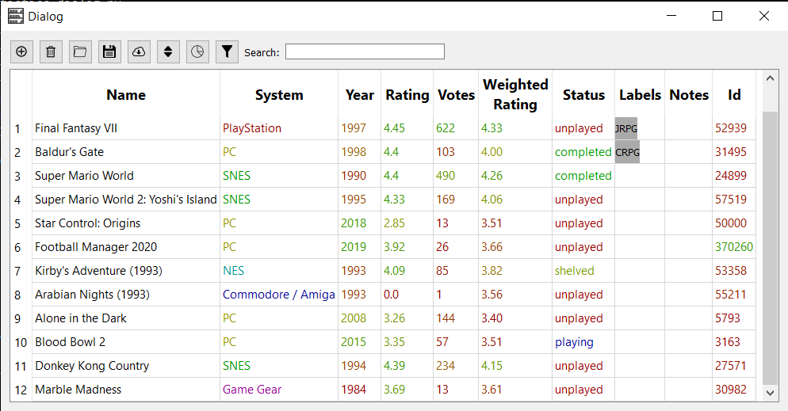

# pyBacklogger

A desktop Python application based on PyQ to manage your videogame collection which includes data scraping from GameFAQs.com.

**[04/08/2020] Notice:** GameFAQs has been making it harder and harder to scrape data from their website for personal use. As a result of that I've spent multiple hours over the last years updating this project. I've decided to transition from GameFAQs to [rawg](https://rawg.io/apidocs) as the data source for pyBacklogger. This will take some time. In the meantime, some options in the master branch's version will not work. 

Contrary to GameFAQs, [rawg](https://rawg.io/apidocs) is a great and rich open data source. Because they offer API endpoints web scraping will become unnecessary and pyBacklogger more robust and stable.



Project's [post-mortem](https://github.com/pablosuau/pyBacklogger/blob/master/postmortem.md)'s document

## How to use it

You just need need to run the following command:

```
python main.py
```

The buttons on the top bar, from left to right, correspond to the following commands:

* **Add games**: games are added to your backlog by scrapping data from GameFAQs.com. You can add one individual game by pasting the game's URL in GameFAQs.com, or you can use the search function, with which you can add one or more games after searching games by name. Once a game is added to the backlog you can edit the year, change the status or add notes by clicking on the corresponding cell on the table. You can also add labels by selecting the corresponding cell. When introducing labels, commas are used to separate labels. 
* **Delete games**:  with this button you can delete the selected games. You can select one game by clicking on the game index on the left side of the window. You can select multiple games by using the Ctrl or Shift keys.
* **Load backlog**: load your previously saved backlog.
* **Save backlog**: saves your backlog into a file.
* **Update ratings**: this option lets you scrap GameFAQs to update the rating and number of votes of the selected games (see the *delete games* option.) You can update a maximum of 500 games at a time. It is recommended to not immediately update more games if you hit this limit until some time has passed. 
* **Sort games**: with this option you can sort your backlog by any column or combination of columns, either in ascending or descending order. 
* **Statistics**: as it is expected, this option will show different statistics about your backlog, like for instance the percentage of finished games per system or per tag.
* **Filter games**: filter out games based on different criteria, like tags, system or status. 
* **Search**: the search bar filters out all the games which name do not contain the string introduced. 

## Weighted ratings

The *Rating* and *Votes* columns, scrapped from GameFAQs.com, are used to calculate a *Weighted Rating* value for each games. This weighted rating is based on [IMDB's rating system]([https://math.stackexchange.com/questions/169032/understanding-the-imdb-weighted-rating-function-for-usage-on-my-own-website](https://math.stackexchange.com/questions/169032/understanding-the-imdb-weighted-rating-function-for-usage-on-my-own-website)). The idea is to assign a high rating to games that not only have an average rating, but also many people voting for them. A higher number of votes provides more evidence about the real rating of a game. Therefore, all those games with a low number of votes have a weighted rating value that is very close to the average rating of your backlog. 